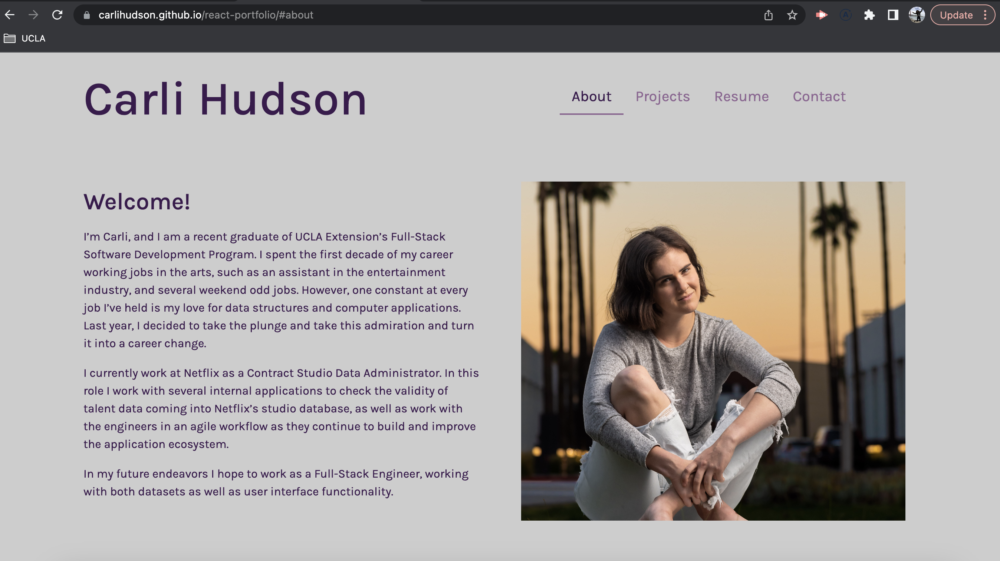
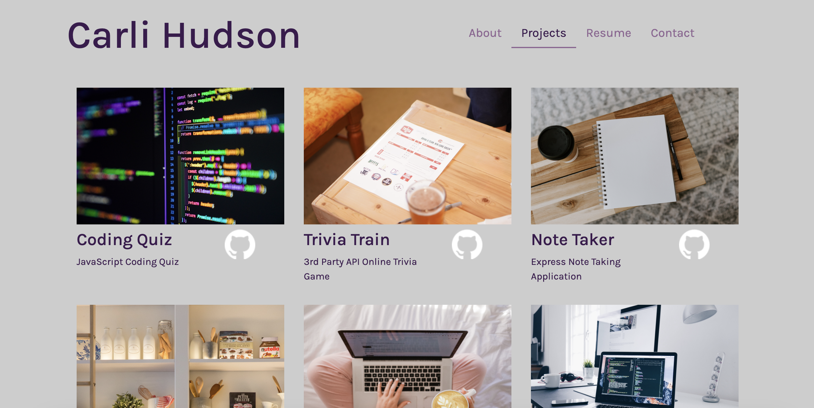
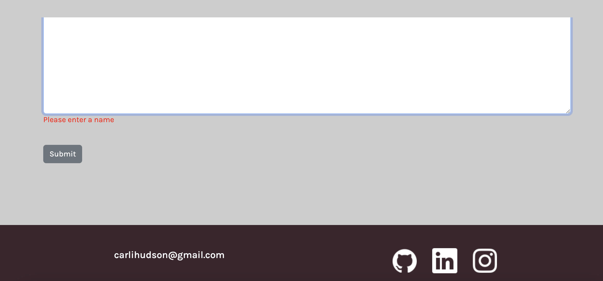

#  Challenge Twenty - React Portfolio

  
        
  ## Description
   This week's assignment was to create a personal portfolio website, with a React front-end. This single-page application can be used to help me show off what I've learned, and be a resource to help me find jobs as I make the transition into software engineering.
  
  ## Table of Contents
  - [Usage](#usage)
  - [Link](#link)
  - [License](#license)
  
  ## Usage
  When you go to the site, the landing page is my "About Me" page. At the top, you can navigate to my "Projects", "Resume", or "Contact" pages. 

  

  On my "Projects" page, there are six projects listed. If you click on the photo or the title, the deployed project will open in another tab. If you click the github logo, the repository for that project in another tab. 

  

  On my "Resume" page, there is a photo of my resume, as well as a link to download it. 

  On the "Contact" page, there's a contact form with three fields all required. Once they're filled out, when you click submit I will get an email sent to me with your message. 

  On the footer, my email address is listed, as well as logos for Github, Linkedin, and Instagram. Click on the logo of a social network, and another tab with my profile from that network will open. 

  

  ## Link
  You can visit my porfolio at https://carlihudson.github.io/react-portfolio/ 
  
  ## License
  This project is covered under the MIT license. To learn more, click the badge at the top.

  ## Questions
  If you have any questions, reach out to me at https://github.com/carlihudson, or shoot me an email at carlihudson@gmail.com.
   